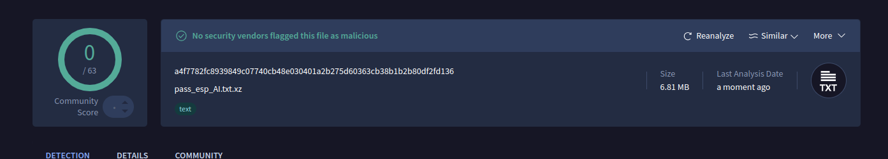

# Password Dictionary Explanation

## Overview (English)
This password dictionary was meticulously designed to include a wide range of common password patterns used by individuals. We aimed to cover diverse categories, leveraging popular cultural references, common naming conventions, and numerical combinations. The final dictionary includes millions of unique passwords, making it a robust tool for testing password strength and performing penetration testing.

## Categories Used
The password dictionary includes the following categories:

1. **Common Patterns**: Basic patterns like `123`, `password`, `qwerty`, combined with years and common suffixes.
2. **Spanish Cultural References**: Names, food items, and common expressions specific to Spanish-speaking countries, like `tortilla2024` or `maria1990`.
3. **Children's Names**: Combinations of common male and female names, such as `alejandrosofia2024`.
4. **Food and Dishes**: Popular food names like `paella`, `jamon`, with numerical suffixes.
5. **Swear Words and Insults**: Common Spanish and international swear words, with variations in upper and lower case and numerical additions, like `gilipollas69`.
6. **Positive Adjectives and Phrases**: Words expressing positive traits, such as `hermoso1980` or `genial2023`.
7. **Festivities and Events**: Popular holidays and events, combined with years, e.g., `navidad2024`, `halloween2023`.
8. **Famous People**: Names of celebrities, both historical and contemporary, like `elonmusk2024` or `michaeljackson1970`.
9. **Combination of Child Names**: Mix of two children's names followed by a year, such as `carmenlucas2024`.
10. **Random Numeric Combinations**: Dates and random numbers, from `06101979` to `31121990`.

## Download / To decompress with tar (if it was created using tar):

  `tar -xJf pass_esp_AI.txt.xz`

  **Verify content without decompressing:**

 `xz -l pass_esp_AI.txt.xz`

 ## [Check file on VirusTotal](https://www.virustotal.com/gui/file/a4f7782fc8939849c07740cb48e030401a2b275d60363cb38b1b2b80df2fd136?nocache=1)

 ## VirusTotal Report

## How to Use
- This dictionary is intended for ethical use in penetration testing and password analysis.
- It can be used with tools like `John the Ripper`, `Hydra`, or `Hashcat` for brute-force attacks.

---

## Descripción General (Español)
Este diccionario de contraseñas fue creado cuidadosamente para incluir una amplia gama de patrones de contraseñas comunes utilizados por las personas. Nuestro objetivo fue abarcar diversas categorías, utilizando referencias culturales populares, convenciones de nombres comunes y combinaciones numéricas. El diccionario final incluye millones de contraseñas únicas, lo que lo convierte en una herramienta robusta para probar la fortaleza de contraseñas y realizar pruebas de penetración.

## Categorías Utilizadas
El diccionario incluye las siguientes categorías:

1. **Patrones Comunes**: Patrones básicos como `123`, `password`, `qwerty`, combinados con años y sufijos comunes.
2. **Referencias Culturales Españolas**: Nombres, comidas y expresiones comunes en países hispanohablantes, como `tortilla2024` o `maria1990`.
3. **Nombres de Niños**: Combinaciones de nombres masculinos y femeninos comunes, por ejemplo, `alejandrosofia2024`.
4. **Comidas y Platos Típicos**: Nombres de alimentos populares como `paella`, `jamon`, con sufijos numéricos.
5. **Insultos y Palabrotas**: Palabrotas comunes en español e internacionalmente, con variaciones en mayúsculas y minúsculas y añadidos numéricos, como `gilipollas69`.
6. **Adjetivos Positivos y Frases**: Palabras que expresan rasgos positivos, como `hermoso1980` o `genial2023`.
7. **Festividades y Eventos**: Fiestas y eventos populares combinados con años, por ejemplo, `navidad2024`, `halloween2023`.
8. **Personas Famosas**: Nombres de celebridades, tanto históricas como contemporáneas, como `elonmusk2024` o `michaeljackson1970`.
9. **Combinación de Nombres de Niños**: Mezcla de dos nombres de niños seguidos de un año, como `carmenlucas2024`.
10. **Combinaciones Numéricas Aleatorias**: Fechas y números aleatorios, desde `06101979` hasta `31121990`.

## Cómo Utilizar
- Este diccionario está destinado para uso ético en pruebas de penetración y análisis de contraseñas.
- Puede utilizarse con herramientas como `John the Ripper`, `Hydra` o `Hashcat` para ataques de fuerza bruta.

  ## Descarga / descomprimir el archivo utilizando tar:

  `tar -xJf pass_esp_AI.txt.xz`

  **Como verificar el contenido del archivo:**

  `xz -l pass_esp_AI.txt.xz`

 ## [Revisar archivo en VirusTotal](https://www.virustotal.com/gui/file/a4f7782fc8939849c07740cb48e030401a2b275d60363cb38b1b2b80df2fd136?nocache=1)

  ## Reporte de VirusTotal

